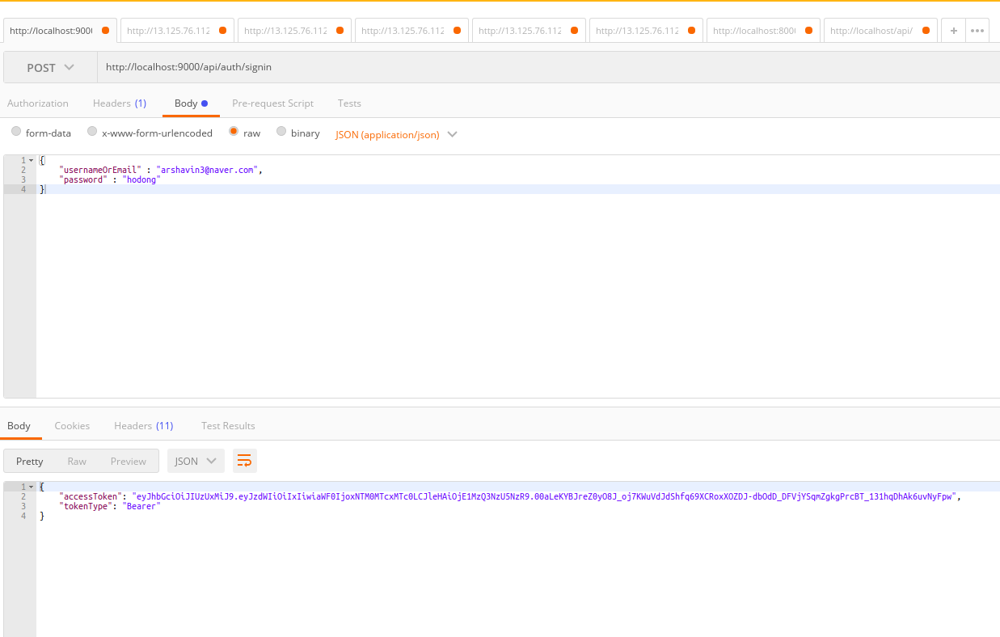

# signal-auth

## Getting Start (server)
**Server** is based on Java(Spring )
- Java 1.8
- spring 5.0
- maven 2.1
- spring config auth + jpa
- mysql(mariadb)

## DB Setting
  spring.datasource.url= jdbc:mysql://localhost:3306/signal_auth?useSSL=false&serverTimezone=UTC&useLegacyDatetimeCode=false
  spring.datasource.username= root
  spring.datasource.password= 1234
- config in src/resource/application.properties

## Start server
```
./mvnw spring-boot:run
```
## Connection
